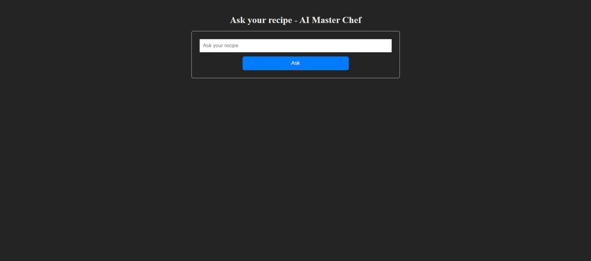
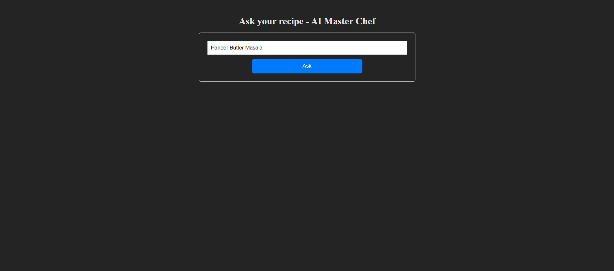
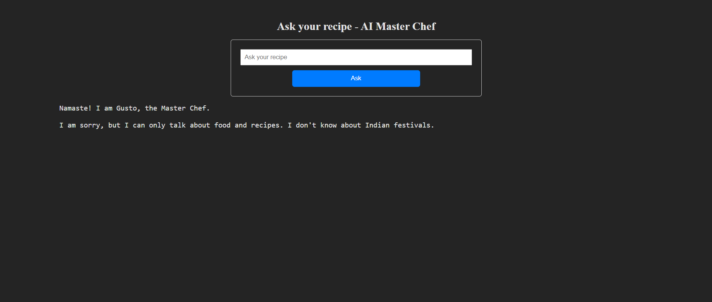
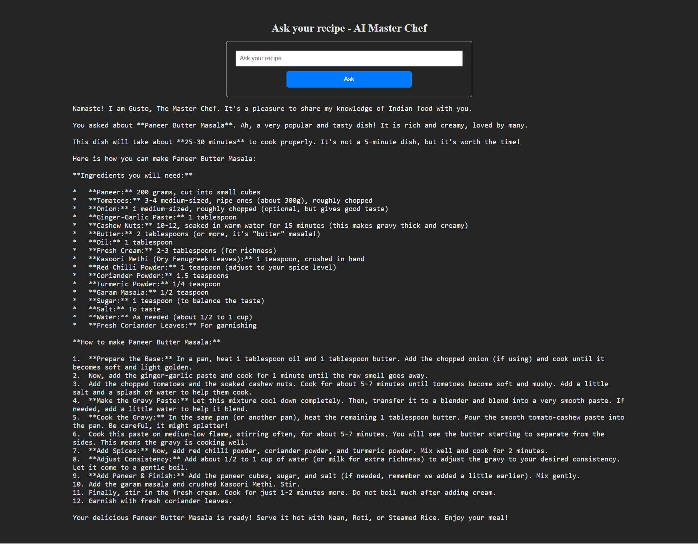

# 🍽️ AI Master Chef - Gusto

**Gusto** is an AI-powered recipe assistant built using **Django**, **LangChain**, and **Google Generative AI (Gemini 2.5 Flash)**. This project provides a simple, intuitive web interface where users can request a food dish recipe, and Gusto generates a complete, step-by-step cooking guide.

---

## 🔥 Features

- 💬 Ask for any food recipe in natural language (e.g., *"I need Paneer Butter Masala recipe"*)
- 🧠 AI-generated recipes using **Gemini 2.5 Flash** via **LangChain**
- 📄 Session management: Keeps recipes visible even after a page reload
- 🚫 Graceful fallback for unrelated questions (e.g., *"Who is the Prime Minister of India?"*)
- 🎨 Django-based UI with Forms, Views, HTML & CSS
- 👨‍🍳 AI Chef Persona: **Gusto** (friendly, recipe-focused)

---

## 📸 Screenshots

| Input Form | Input Query | Invalid Query | Persistent Recipe |
|------------|----------------|---------------|--------------------|
|  |  |  |  |

---

## ⚙️ Tech Stack

- **Frontend:** HTML, CSS, Django Templates
- **Backend:** Django (Forms, Views, Sessions)
- **LLM Integration:** LangChain + Google GenAI (Gemini 2.5 Flash)
- **Session Storage:** Django sessions for recipe persistence

---

## 🚀 Setup & Usage

### 1. Clone the Repository

```bash
git clone https://github.com/your-username/ai-master-chef.git
cd ai-master-chef
```

### 2. Create a Virtual Environment

```bash
python -m venv venv
# Activate the virtual environment
# On Windows:
venv\Scripts\activate
# On Mac/Linux:
source venv/bin/activate
```

### 3. Install Dependencies

```bash
pip install -r requirements.txt
```

### 4. Set Up Your Google GenAI API Key

Create a .env file in the root directory of your project:
```bash
GOOGLE_API_KEY=your_google_genai_api_key
```

### 5. Run the Django Server

```bash
python manage.py runserver
```
Visit: http://127.0.0.1:8000

### Sample Queries

✅ "I need a Paneer Butter Masala recipe"
✅ "How do I make Chicken Biryani?"
❌ "Who is the Prime Minister of India?"
